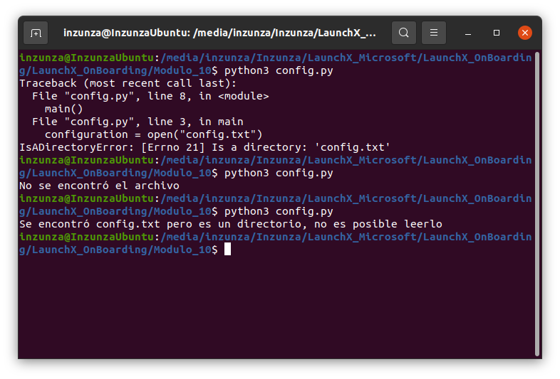

# Práctica Módulo 10

## Ejercicios
Se ralizan las prácticas sugeridas.

### Uso de Tracebacks  
Se ejecuta el siguiente código en `open.py` para genear un traceback:
```
def main():
    open("/path/to/mars.jpg")

if __name__ == '__main__':
    main()
```

Resultado:  
  

### Controlando las excepciones
Para controlar la excepción en el archivo `config.py` se crea una función que intenta abrir un archivo `config.txt` y controlando la excepción para arrojar un mensaje con la excepción `FileNotFoundError` y otro mensaje con la excepción `IsADirectoryError`:
```
def main():
    try:
        configuration = open("config.txt")
    except FileNotFoundError:
        print("No se encontró el archivo")
    except IsADirectoryError:
        print("Se encontró config.txt pero es un directorio, no es posible leerlo")

if __name__ == '__main__':
    main()
```
Resultado de FileNotFoundError: 
  

Resultado de IsADirectoryError:  
  

Ahora se utiliza la palabra clave `as` para obtener el error dentro de una variable y poder imprimirla o utilizarla en el manejo de errores, en este caso se almacena en la variable `err`:
```
def main():
    try:
        configuration = open("config.txt")
    except FileNotFoundError as err:
        print("No se encontró el archivo:", err)
    except IsADirectoryError as err:
        print("Se encontró config.txt pero es un directorio, no es posible leerlo", err)

if __name__ == '__main__':
    main()

```

  

Ahora se obtienen las excepciones generales desde `OSError` que es la excepción primaria tanto de `FileNotFoundError` y `IsADirectoryError`, de esta manera se verifica el número que corresponde a cada excepción dentro de `OSError`, #2 y #21 en estos casos respectivamente.
```
def main():
    try:
        configuration = open("config.txt")
    except OSError as err:
        if err.errno == 2:
            print("No se encontró el archivo:", err.strerror)
        elif err.errno == 21:
            print("Se encontró config.txt pero es un directorio, no es posible leerlo: ", err.strerror)

if __name__ == '__main__':
    main()
```
Resultado:  
  

## Generación de excepciones.
Se generan diferentes excepciones para determinar el cumplimiento de condiciones dentro de una función, de esta manera se puede indicar a otro módulo del programa que realice alguna acción o simplemente mostrar un error al usuario con más detalles. 

Se realizan diferentes prácticas con el archivo `agua.py` para generar excepciones de acuerdo a los resultados.
```
def water_left(astronautas, aguaRestante, diasRestantes):
    for valor in [astronautas, aguaRestante, diasRestantes]:
        try:
            valor / 10
        except TypeError:
            raise TypeError(f"Todos los valores deben de ser números pero se recibió un valor: '{valor}'")
    usoDia = astronautas * 11
    usoTotal = usoDia * diasRestantes
    aguaTotal = aguaRestante - usoTotal
    if aguaTotal < 0:
        raise RuntimeError(f"No hay agua suficiente para {astronautas} astronautas después de {diasRestantes} dias.")
    return f"El agua que resta después de {diasRestantes} dias es: {aguaTotal} litros."
print(water_left(5, 100, 2))
```

  


  

```
def water_left(astronautas, aguaRestante, diasRestantes):
    for valor in [astronautas, aguaRestante, diasRestantes]:
        try:
            valor / 10
        except TypeError:
            raise TypeError(f"Todos los valores deben de ser números pero se recibió un valor: '{valor}'")
    usoDia = astronautas * 11
    usoTotal = usoDia * diasRestantes
    aguaTotal = aguaRestante - usoTotal
    if aguaTotal < 0:
        raise RuntimeError(f"No hay agua suficiente para {astronautas} astronautas después de {diasRestantes} dias.")
    return f"El agua que resta después de {diasRestantes} dias es: {aguaTotal} litros."
print(water_left("5", 100, 2))
```

  

