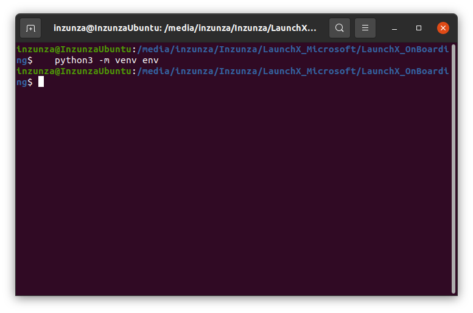
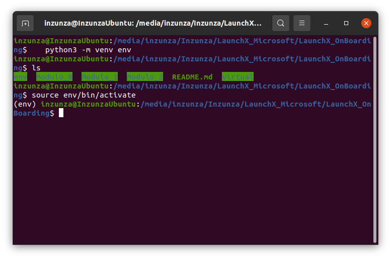
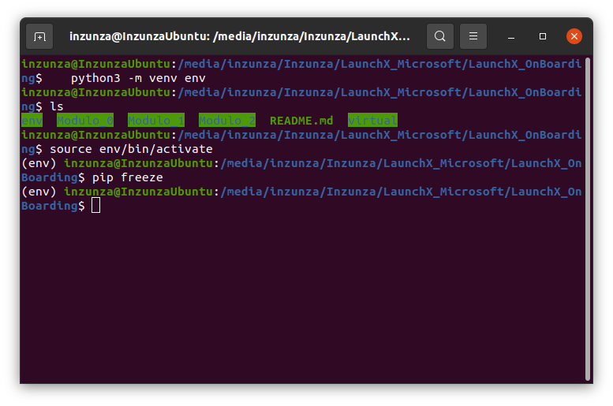
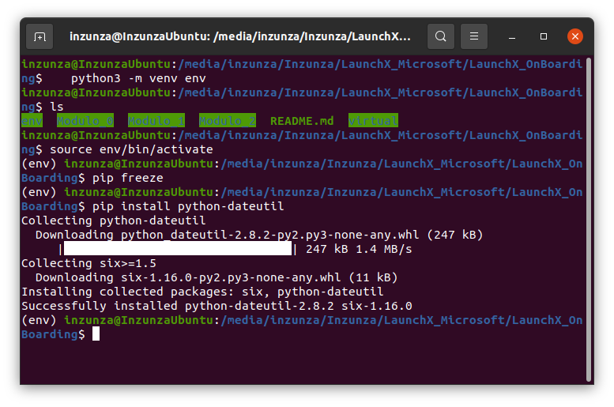
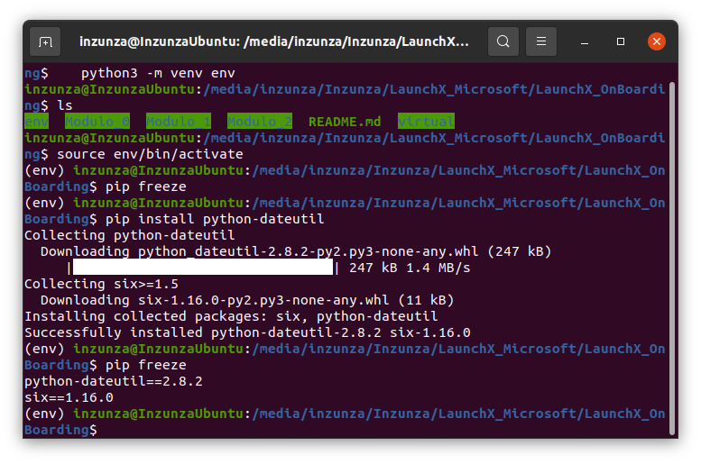
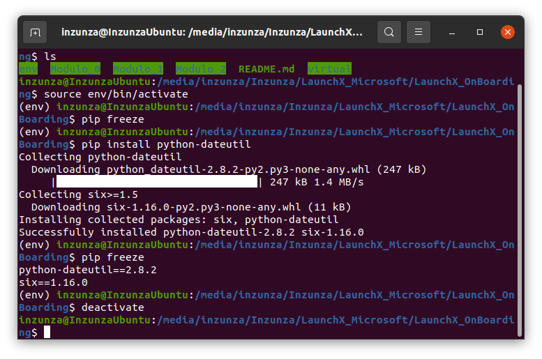

# Ejercicio - Crear un paquete

En este ejercicio, se aprende a utilizar entornos virtuales como una forma para no afectar a los paquetes instalados globalmente u otros programas que se ejecutan en la máquina.

Todos los comandos se ejecutan desde la terminal.

## Crear un entorno virtual

Se crea un entorno virtual mediante ``venv``

* Se ejecuta en terminal la instruccion: ``python3 -m venv env``    
Resultado:  


* Se ejecuta el comando para activar el entorno virtual: ``source env/bin/activate``  
Resultado:  
  

## Instalar una biblioteca

Ahora dentro del entorno virtual, se procede a instalar una biblioteca, esta solo existirá en el entorno virtual.

* Se ejecuta el comando ``pip freeze`` para ver las bibliotecas instaladas en el entorno:  
Resultado:  
  

 *No se obtiene respuesta ya que no se tiene ninguna biblioteca aún*

* Se ejecuta el comando ``pip install python-dateutil`` para instalar una biblioteca en el entorno virtual:  
Resultado:  
  

*Se obtiene como respuesta un mensaje de instalación satisfactoria*  

* Se vuelve a ejecutar ```pip freeze``` para ver cómo ha cambiado la lista de bibliotecas:  
Resultado:  
  

* Se obtiene como resultado la siguiente lista:
    ```
    python-dateutil==2.8.2
    six==1.16.0
    ```

### Desactivar un entorno virtual

Para el cambio de entornos virtuales, en caso de trabajar con varios proyectos a la vez, se debe salir (desactivar) del entorno virtual.

* Se ejecuta el comando ``deactivate``:  
Resultado:  
  

Se observa cómo cambia el mensaje de la terminal ``(env)`` a cómo se veía antes.

Fin de la práctica.
